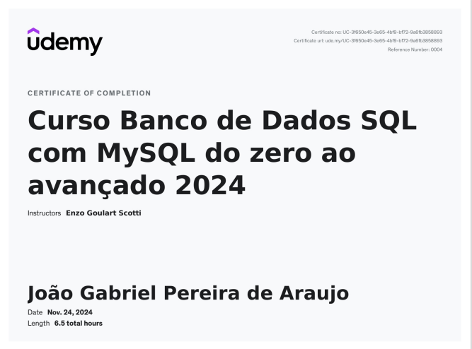
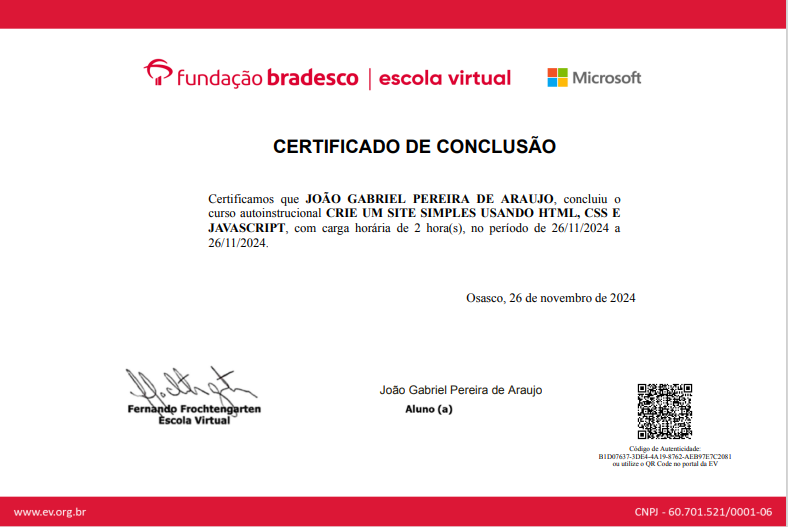
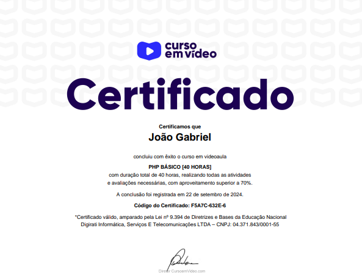

# Certificates

Courses and trainings completed by **João Gabriel Pereira de Araújo**.

---

| Course | Institution | Workload | Completed | Verification |
|---|---|---|---|---|
| Banco de Dados SQL com MySQL do zero ao avançado | Udemy | 6.5 h | Nov 24, 2024 | [ude.my/UC-3f650e45-3e65-4bf9-bf72-9a6fb3858893](https://ude.my/UC-3f650e45-3e65-4bf9-bf72-9a6fb3858893) |
| Crie um site simples usando HTML, CSS e JavaScript | Fundação Bradesco (Escola Virtual) + Microsoft | 2 h | Nov 26, 2024 | Code `B1D07637-3DE4-4A19-8762-AEB97E7C2081` at [ev.org.br](https://www.ev.org.br) |
| PHP Básico | Curso em Vídeo | 40 h | Sep 22, 2024 | Code `F5A7C-632E-6` at [cursoemvideo.com](https://www.cursoemvideo.com) |

---

## Udemy — Banco de Dados SQL com MySQL

## Fundação Bradesco + Microsoft — HTML, CSS and JavaScript

## Curso em Vídeo — PHP Básico

